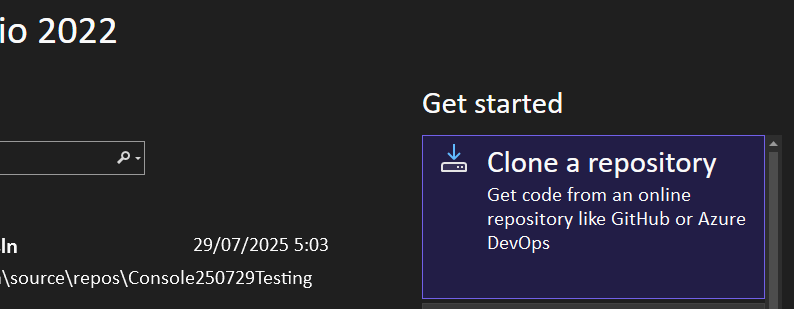
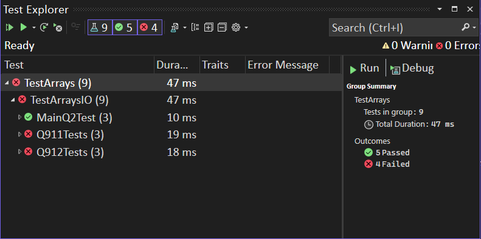

# תרגול עם בדיקות אוטומטיות

## תחילה נוריד את הפרוייקט מ-Github
1. נעתיק את ה-URI ל-clipboard:
    https://github.com/3strategy/ConsArrays
2. במקום לפתוח פרוייטק חדש נבחר Clone
    
3. **נאשר** והפרוייטק יופיע לנו במחשב.
4. במחשבים עם התקנות ישנות יש צורך לסגור את Visual Studio 
    ואז לפתוח את קובץ ה-.sln.   אחרת, המחשב יתייחס לפרוייקט כאל תיקייה ולא כאל פרוייקט VS

## כעת ניתן להפעיל בדיקות כדי לראות שהכל עובד
1. בוחרים בתפריט Test
1. בוחרים Run All Tests. חלק מהבדיקות יופיעו בירוק וחלק באדום
    
1. אם נבחר Debug All Tests הבדיקה תעצר בשגיאה הראשונה

## נפתח את קובץ program.cs ונפתור את השאלה הראשונה
1. double click the program.cs
1. לחצו **F5** או ⏵ ובדקו שיש פלט למסך. הפלט הוא מהפונקציה Q911 שעליכם לערוך.
1. לאחר שהפתרון נראה מוכן - יש להריץ שוב את הבדיקות. עושים זאת מתפריט Test > Debug All
1. יש לתקן ולשפר את הפתרון עד שכל הבדיקות של Q911 יעברו בהצלחה
1. לאחר מכן יש לפתור את Q922

😀בהצלחה😀

